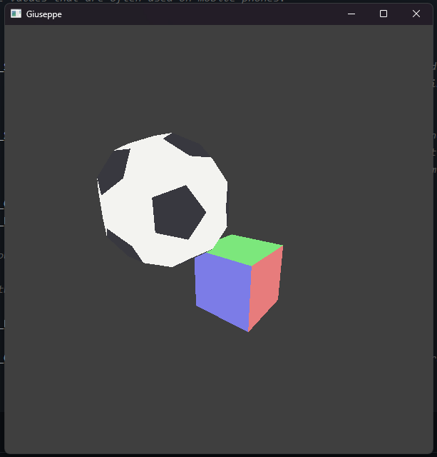

# gleed-ash



A Vulkan game engine written in Rust, with a small test game on top of it. It
is a Rust rewrite of my previous C++ engine using Claude: SDL3 for window, input
and surface, glam instead of GLM, gpu-allocator instead of VMA, and shaders
written in Slang. The original C++ engine was 100% handwritten.

## Workspace

- `vk`: the only entry point to Vulkan. Reexports what we use from `ash` and
  adds `raii`, a thin wrapper with automatic drop.
- `engine`: the engine itself (device, swapchain, renderer, meshes, input).
- `game`: the executable. Uploads two meshes and moves the camera.

## Requirements

- Rust (edition 2024).
- A GPU and driver with Vulkan 1.4.
- Vulkan SDK, which also provides `slangc` (needed at build time) and the
  validation layers (enabled in debug builds).
- SDL3: `SDL3.lib` for linking and `SDL3.dll` next to the executable. As an
  alternative, add the `build-from-source` feature to `sdl3` in
  `engine/Cargo.toml` and SDL is built along with the project.

## Running

```sh
cargo run           # debug, with validation layers
cargo run --release
```

Or just press F5 and be happy with VSCode debugger.

Shaders in `engine/src/shaders/` are compiled to SPIR-V by `engine/build.rs` on
every build; `slangc.sh` does the same thing outside cargo.
